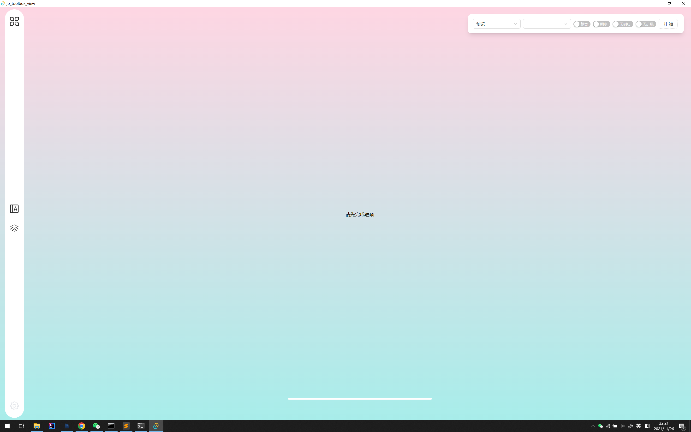
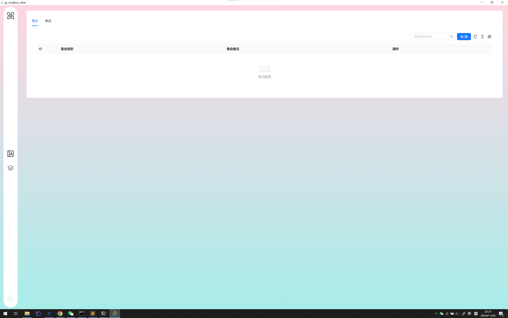
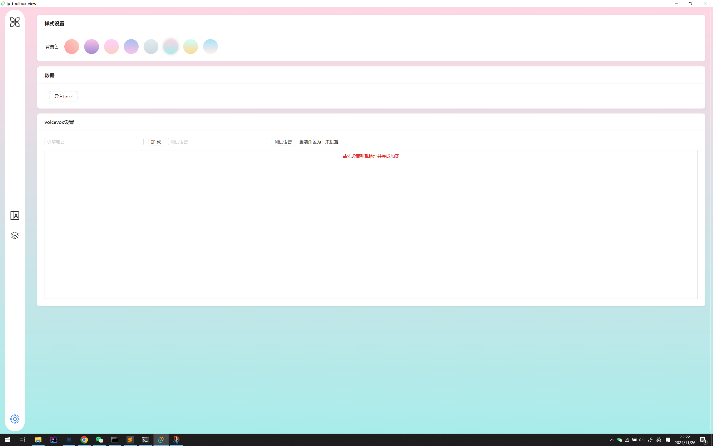

# jp_toolbox

## 开发环境
1. 请先安装rust,并配置好MSVC环境
2. npm run tauri dev 开发环境启动
3. npm run tauri build 打包

## 软件截图

## 使用说明
1、可以设置页面导入数据，数据格式参考xlsx中示例数据.xlsx
2、voicevox可以本地部署,地址是:https://github.com/VOICEVOX/voicevox 填入:http://localhost:50021
